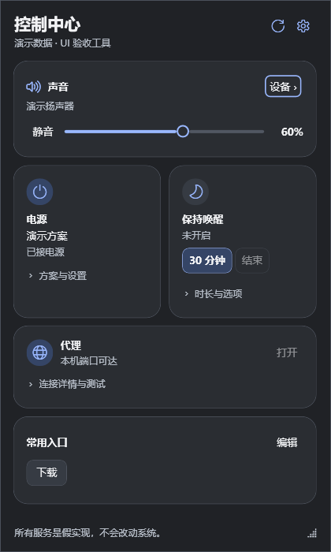

# 个人控制中心

一个放在 Windows 托盘里的轻量控制面板，集中管理音量、电源方案、临时保持唤醒、代理检测和常用入口。

0.9.0 收紧日常面板：亮度百分比、长名称截断、详情折叠，并按现有设备和电源方案显示控制项。麦克风、输出和亮度直接调用对应系统服务。保留六套配色与 CSS 主题变量，可在设置中预览、导入导出并保存。[主题说明](docs/THEMES.md)。首页只放收藏，“全部功能”提供媒体、麦克风、亮度、连接状态、场景与更新；窄窗口自动单列。顶栏可固定面板，窗口位置与大小跨重启保存。

截图为假数据验收窗口，实际状态来自你的电脑。支持浅色与深色主题。

## 下载与使用

**[下载 0.9.0 · Windows x64 ZIP](https://github.com/hqc135/personal-control-center/releases/download/v0.9.0/PersonalControlCenter-0.9.0-win-x64.zip)** · [发布说明与 SHA256](https://github.com/hqc135/personal-control-center/releases/tag/v0.9.0)。私有仓库需先登录有访问权限的 GitHub 账号。下载后完整解压即可运行；这是供日常试用的预发布版。

1. 下载 ZIP，完整解压到你想放置的目录。
2. 双击 `PersonalControlCenter.exe`，即可使用。
3. 点击托盘图标打开或收起面板，右键托盘图标可退出。

拖动面板顶部标题可移动窗口，拖动边缘或右下角可调整大小；重新打开和重启均保留位置与大小。“全部功能”可重置窗口位置。

支持 **Windows 11 x64（内部版本 22621 及以上）**。ZIP 已包含 .NET 桌面运行时，**无需另装 .NET、无需管理员权限**。不要只拷贝 EXE，也不要在压缩包里直接运行。

仓库目前为私有仓库，下载时请先登录有访问权限的 GitHub 账号。请下载上面的应用 ZIP；GitHub 自动生成的 `Source code` 是源码。

## 能做什么

- **声音**：调节当前输出音量、静音，查看输出设备。
- **电源**：切换 Windows 电源方案。
- **保持唤醒**：按时长临时保持电脑唤醒，可选择屏幕常亮。
- **代理**：查看本机代理端口状态，手动测试指定目标。
- **常用入口**：集中打开文件夹、网页和确认过的程序。
- **个性化**：浅色/深色、模块排序与隐藏、全局快捷键、可选登录自启。
- **设备**：电池状态、麦克风静音、按屏幕调亮度、默认输出直接切换。
- **媒体与连接**：各播放器的曲目和播放控制、网络接口与蓝牙状态。
- **效率**：入口搜索与键盘启动、收藏布局、可预览和恢复的自定义场景。
- **更新**：手动检查，支持私有仓库临时 token、本地 ZIP 校验、并排保留版本以回退。

系统若只有一个电源方案，面板会明确提示。自启默认关闭。设备能力按实际读取结果显示；亮度与音频直切不支持时提供系统设置入口。蓝牙和网络当前提供只读状态与设置入口。

## 更新与数据

更新前从托盘退出，解压新版替换程序文件。配置独立保存在 `%LOCALAPPDATA%/PersonalControlCenter`，不会因替换程序文件而被删除。移动程序目录前，如已启用自启，请先关闭自启，再在新位置重新启用。

## 文档

- [扩展功能清单与新版布局](docs/FEATURE_ROADMAP.md)：已有能力、下一批优先项、后续硬件功能和分批验收路线。

- [使用说明](docs/USER_GUIDE.md)：详细操作、备份迁移、更新卸载与常见问题。
- [维护说明](docs/MAINTENANCE.md)：源码结构、开发环境、构建测试和发布流程。
- [验收记录](docs/acceptance/UI-2026-10-02.md) · [发布检查](docs/RELEASE_CHECKLIST.md)

当前源码为 **0.9.1 本地候选**（`artifacts/PersonalControlCenter-0.9.1-win-x64.zip`），GitHub 已发布版仍为上方 0.9.0。202 项自动测试及本轮连续性交互的假数据界面验收通过；已完成此机只读探测、面板刷新和退出验收，并修复重复亮度读取与退出异常。真实写入控制、性能、多屏/DPI 等完整矩阵仍待验收。程序未签名，当前用于个人试用。见 [本轮验收](docs/acceptance/0.9.1.md)。
