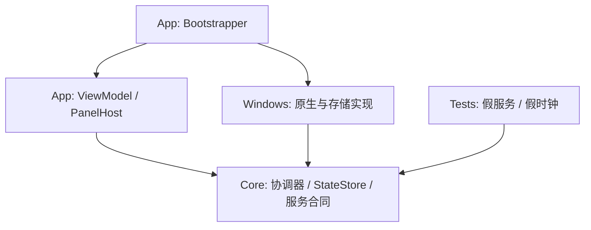

# 实现架构与设计决策

状态：B0–B2b 已实施，具体调整见 DECISIONS.md。原生接口、性能和兼容性尚未真机验证；本文保留目标架构，实际进度见 IMPLEMENTATION_STATUS.md。

## 结构

沿用 C# / .NET 10 / WPF / MVVM，单进程模块化单体。B0 核实 SDK 支持与安装状况，再锁定具体补丁和依赖。

```text
src/ControlCenter.App/       视图、ViewModel、PanelHost、主题、组合根
src/ControlCenter.Core/      模型、合同、协调器、状态仓库、配置校验
src/ControlCenter.Windows/   原生接口、托盘、IPC、存储、日志、启动器
tests/ControlCenter.Tests/   假服务、假时钟、竞态和状态机测试
docs/acceptance/             每批验收证据
artifacts/                  本地候选包，不作为源码提交
```



箭头表示编译依赖。App 引用 Windows 只用于组合根注入实现，ViewModel 依赖 Core 合同。Core 不引用 WPF、COM、注册表或进程 API。Windows 模块间不相互编排。

## 状态与并发

模块快照包含 ObservedAt、Revision、Capability、刷新/过期标记、错误和不可变数据。命令状态独立为 Idle / Pending / Confirmed / Partial / Failed / UnknownOutcome。原始 bool Success 草图扩展为明确结果类型，表达角色部分成功、原生已写但验证失败。

统一流程：校验 → 记录 operation ID/目标 → 排队 → 原生调用 → 回读 → 发布实际结果。取消令牌不等于撤销原生写入，验证超时显示“结果待确认”。

每模块维护 epoch；查询捕获 epoch 与 query ID。开始写入、设备失效或更新事件推进 epoch，迟到旧查询丢弃。原生回调转换成不可变事件入串行队列；UI 经 Dispatcher 更新。

- 音量按 endpoint ID 合并最新目标，最多约 30 次/秒，松手确保最终值；设备拔出清除该目标的待执行队列，不改写新设备。
- 电源串行执行，待执行请求可合并，回读才显示选中。
- 音频角色分别回读，部分成功不无条件回滚。
- 超时、错误、刷新按模块隔离，不让一个模块拖住整个窗口。

## 生命周期

| 所有者 | 资源与规则 |
|---|---|
| Shell | WPF Dispatcher、面板、托盘；隐藏保留宿主，退出释放 |
| AudioWorker | B0 固定 COM apartment；负责对象创建、回调解绑与释放，UI 不持有 COM |
| ExecutionStateWorker | 长期专用线程，同线程设置/清除请求；退出清除并 join |
| ProxyProbe | 短生命周期异步连接；隐藏取消无必要请求 |
| ConfigRepository | 串行临时文件与原子替换，及时释放句柄 |

唤醒同时用 UTC 截止与单调预算，任一到期即结束；恢复先检查是否到期。UI 倒计时与系统请求独立。B3 验证跨睡眠计时语义。

退出：停止接收命令 → 取消探测 → 优先清除唤醒并等待专用线程 → 有界等待协调器/音频/电源清理 → 释放托盘/IPC/mutex → 退出。每步默认 3 秒期限，某步失败仍继续；不能无限等待，也不能掩盖释放失败。

B3 实装：Core/Awake.cs 提供假时钟可测的状态机，Windows/AwakeService.cs 拥有固定线程；Core/Proxy.cs 拥有可见性、10 秒节流与结果代次，Windows/ProxyProbe.cs 封装可注入传输；SessionViewModel 与音频/电源协调器分开组合。隐藏不派发唤醒 UI 刷新，活动请求仍每秒检查截止；没有活动请求时专用线程阻塞等待。托盘注册逻辑独立为 TrayRegistration，可假接口测试。退出日志仅固定结果字段，完整诊断预算留后续验收。

## 原生与存储边界

- 音量使用 Core Audio；默认输出切换单独能力门。未验证就回退系统声音设置。
- 电源发现实际 GUID，仅切现有方案，不改参数、不自动提权。
- 托盘封装 TaskbarCreated；创建失败保留普通窗口入口。定位按 PerMonitorV2 转换到目标屏幕并限制到 rcWork。
- 单实例 mutex 与管道按当前用户/会话限定，管道只接收有界 ShowPanel 消息。
- 代理限制 loopback；TCP 与显式 HTTP 代理手动测试分开。无凭据、无 TLS 绕过、无后台外网探测；若支持重定向，限制次数并校验目标协议。
- 程序启动用 ArgumentList；网页限制 http/https；ms-settings 仅内置白名单。
- 配置沿用 schemaVersion=1；256 KiB、20 入口、5 备份；临时文件 flush 后原子替换。高版本保留不覆盖，损坏保留原件并提示恢复来源。
- 导入配置不能自带可信 confirmed 状态；本机确认记录独立保存，路径/参数变化后重新确认，不随配置导出。
- 演示包独立组合根装配假服务，包名与界面标 DEMO；正式包只使用真实服务，失败不能回退假数据。保持 --show / --tray 参数合同。
- 日志单文件 2 MiB、最多 5 份；脱敏，记录操作 ID、耗时和结果。state.json 不保存下次自动执行的系统操作。

## 决策记录

| ID | 决策 | 与原文关系 |
|---|---|---|
| ADR-001 | 当前目录直接作为项目根 | 不套额外同名子目录 |
| ADR-002 | 原生托盘/IPC 在 Windows，宿主编排在 App | 澄清低层职责 |
| ADR-003 | 明确 Partial / UnknownOutcome | 完善原始 bool Success 草图 |
| ADR-004 | B0 只读探针，设备切换真写验证在 B4b | M0 风险结论不等于兼容通过 |
| ADR-005 | B1 配置基础，B4 完整设置迁移 | 避免早期硬编码和后期重写 |
| ADR-006 | 按用户选定批次执行，批内自主修复 | 不自动采用附件全阶段执行指令 |

## 技术依据

B5 增补：AwakeService 关闭时先拒绝待执行任务，生命周期锁保护队列结束/释放与并发提交。ShutdownEntry 提供退出 correlation ID、耗时与 HRESULT；日志观察者异常不得阻断后续清理。显示设置事件和 WPF OnDpiChanged 触发重新限制工作区，订阅随 App 退出释放。发布从干净 Git 提交生成构建收据、源码清单和包内哈希，区分 FDD 与未生成的 SCD。

B4 增补：ConfigurationTransfer 为无副作用的便携草稿转换；ConfigFiles 限额读取/原子导出；IConfigRecovery 只读预览备份。模块顺序通过已有 WPF 卡片重排，不复制业务 ViewModel；协调器停止隐藏模块普通刷新。HotkeyController 由 UI 线程拥有，通过可替换后端先注册新键再释放旧键，冲突与释放失败独立处理。UserStartupService 不从配置自动装配写操作，只允许设置页独立按钮调用；对本用户单个 Run 值做前值比较与后值回读。AudioSwitchCapability 不受配置开启，真实切换继续降级。

2026-09-26 已阅读官方资料，仅用于能力边界，不代表本机通过：

- [WPF 概览](https://learn.microsoft.com/en-us/dotnet/desktop/wpf/overview/)：Windows 桌面 UI、绑定、布局、动画。
- [IAudioEndpointVolume](https://learn.microsoft.com/en-us/windows/win32/api/endpointvolume/nn-endpointvolume-iaudioendpointvolume)：端点音量、静音与通知。
- [SetThreadExecutionState](https://learn.microsoft.com/en-us/windows/win32/api/winbase/nf-winbase-setthreadexecutionstate)：线程请求与清除、主动睡眠限制。
