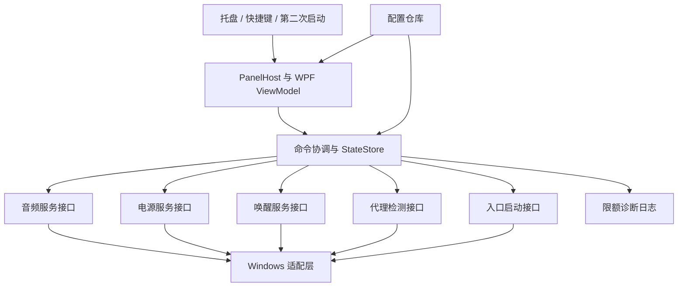

# Personal Control Center — 完整开发规格

版本：1.0 · 日期：2026-09-11 · 状态：开发设计，尚未实现或实测  
目标读者：实现开发者、界面设计者、测试者及未来维护者  
工作名称：Personal Control Center（个人控制中心，简称 PCC）

## 1. 产品目标与用户背景

开发一个以普通用户权限运行的 Windows 托盘小程序，集中处理音量、音频输出、电源计划、临时保持唤醒、本机代理状态和常用入口。核心价值是减少高频系统操作步骤，并提供统一、克制、有个人风格的界面。

已确认用户偏好：喜欢 macOS 风格、苹方字体、简洁布局；不喜欢卡顿、拖沓和缺乏连贯性的动画。Chrome 是主浏览器，VS Code 用于通用代码与 AI 辅助。用户已有 PowerToys、FancyZones、PixPin、Clash Verge 等，不重复实现它们的完整功能。

历史测试机资料：Dell G15 5520、i7-12700H、16 GB RAM、Intel 核显与 RTX 3060 Laptop、2560×1440/240 Hz 内屏、自定义缩放约 135%。当前系统及设备必须由程序运行时发现，不能将历史快照当成固定事实。此前高性能和平衡方案保存的亮度不同，因此切换方案可能影响亮度等其他策略，界面不能承诺它只改变 CPU 行为。

### 1.1 成功标准

- 托盘点击后立即出现可操作面板，不等待所有系统查询结束。
- 操作系统状态与面板一致；失败不显示成功。
- 隐藏时无持续渲染、无高频 WMI/PowerShell 查询、无远程网络请求。
- 退出释放本程序的保持唤醒请求；不遗留服务或系统计划变更。
- 配置可备份、可恢复、可迁移，发布包不携带个人路径、密钥或字体文件。

### 1.2 v1 范围

| 功能 | v1 要求 | 不包含 |
|---|---|---|
| 音频 | 当前输出、音量、静音、设备列表；兼容性通过后启用输出切换 | 均衡器、音效增强、逐应用混音 |
| 电源 | 枚举与切换现有方案，显示当前方案 | 修改方案参数、风扇、BIOS、自动游戏检测 |
| 唤醒 | 30/60 分钟或自定义时长，屏幕常亮可选 | 强制阻止合盖/用户主动睡眠 |
| 代理 | 本机端口检查、打开 Clash、手动端到端测试 | 写代理设置、切节点、管理订阅、读取 Clash 密钥 |
| 快捷入口 | 下载/截图/项目目录、程序或 HTTPS 网页 | 任意 shell 字符串、后台自动化引擎 |
| 程序本身 | 托盘、快捷键、设置、日志、可选用户自启 | 插件市场、云同步、遥测、常驻管理员服务 |

亮度控制暂不进入 v1；字体、桌面样式、系统动画也不由本程序修改。

## 2. 技术决策

| 决策 | 选择与理由 |
|---|---|
| 平台 | Windows 11 x64；API 基线 22621；发布验证覆盖仍受支持的 Windows 11 稳定版，另测用户 Insider 环境 |
| 语言与运行时 | C#、.NET 10 LTS；启动项目时选择最新受支持的 10.0 SDK 补丁并固定在 global.json |
| UI | WPF + XAML；使用 MVVM，Windows Forms 仅可用于托盘包装，不出现 WinForms 主界面 |
| 结构 | 单进程、模块化单体；三个生产项目，一个测试项目 |
| 状态 | 类型化不可变快照、明确命令结果，事件通知驱动 |
| 配置 | System.Text.Json；版本化 JSON；同目录临时文件与原子替换 |
| Windows 调用 | 薄适配层封装 P/Invoke/COM；原生句柄使用 SafeHandle 或显式生命周期管理 |
| 发布 | win-x64 自包含目录式 ZIP，默认不裁剪、不启用 Native AOT；后续再评估打包 |

.NET 10 LTS 支持到 2028 年 11 月，见 [运行时支持政策](https://learn.microsoft.com/en-us/dotnet/core/releases-and-support)。WPF 的样式、数据绑定与自定义模板足以支撑本产品，见 [WPF 概览](https://learn.microsoft.com/en-us/dotnet/desktop/wpf/overview/)。本文件不编造精确 NuGet 版本；开工时固定已验证版本和锁文件。

### 2.1 可选依赖

- CommunityToolkit.Mvvm：生成 ObservableProperty/RelayCommand；不引入依赖它的领域模型。
- 托盘：优先原生 Shell_NotifyIcon 封装；如果选择成熟托盘库，必须验证 Explorer 重启、DPI 和释放句柄，固定版本与许可证。
- 测试框架：xUnit 或 NUnit 任选一套并固定；模拟 Windows 适配器。
- 音频库不是必须。若采用第三方封装，默认设备切换部分必须明确其底层是否依赖非公开接口。

避免为了单个控件引入完整 UI 套件。第一版不依赖 WebView、远程字体、CDN 或本地 HTTP 服务。

## 3. 架构与依赖



编译依赖：App → Core；Windows → Core；App 在组合根引用 Windows 并注入实现。Core 不引用 WPF、注册表、进程类或 COM。Windows 模块之间不相互调用，跨模块行为由协调器负责。

```text
src/
  ControlCenter.App/
    App.xaml / App.xaml.cs
    Composition/Bootstrapper.cs
    Shell/PanelHost.cs, TrayHost.cs, SingleInstanceHost.cs
    Views/ControlPanel.xaml, SettingsWindow.xaml
    ViewModels/PanelViewModel.cs, SettingsViewModel.cs
    Modules/AudioViewModel.cs, PowerViewModel.cs, ...
    Themes/Tokens.xaml, Light.xaml, Dark.xaml, Controls.xaml
    Motion/PanelTransitionController.cs
  ControlCenter.Core/
    Models/Snapshots.cs, CommandResult.cs, Capabilities.cs
    Contracts/IAudioService.cs, IPowerService.cs, ...
    Coordination/CommandCoordinator.cs, StateStore.cs
    Configuration/AppConfig.cs, ConfigValidator.cs
  ControlCenter.Windows/
    Audio/CoreAudioService.cs, DefaultEndpointSwitcher.cs
    Power/PowerSchemeService.cs, PowerEventSource.cs
    Awake/ExecutionStateWorker.cs
    Proxy/LoopbackProbe.cs, ManualRouteProbe.cs
    Launch/ShortcutLauncher.cs
    Configuration/JsonConfigRepository.cs
    Diagnostics/RollingLogger.cs
    Interop/NativeMethods.cs, NativeHandles.cs
tests/ControlCenter.Tests/
docs/manual-test-results/
```

## 4. 接口与状态合同

以下为接口设计，不是已经验证可编译的 SDK；实现时拆分到对应文件。

```csharp
public enum Availability { Available, Unsupported, PermissionDenied, Unavailable }
public enum FailureCode {
    None, Unsupported, PermissionDenied, DeviceGone,
    Timeout, InvalidConfiguration, VerificationFailed, NativeFailure, Cancelled
}
public record Capability(Availability Status, string? Reason);
public record CommandResult(bool Success, FailureCode Code, string? UserMessage);
public record ModuleState<T>(T? Value, bool IsRefreshing, bool IsStale,
    DateTimeOffset? ObservedAt, string? Error);

public interface IAudioService : IAsyncDisposable {
    event EventHandler<AudioSnapshot>? Changed;
    Task<AudioSnapshot> ReadAsync(CancellationToken ct);
    Task<CommandResult> SetVolumeAsync(string endpointId, float scalar, CancellationToken ct);
    Task<CommandResult> SetMuteAsync(string endpointId, bool muted, CancellationToken ct);
    Task<CommandResult> SetDefaultAsync(string endpointId, CancellationToken ct);
}
public interface IPowerService {
    event EventHandler<PowerSnapshot>? Changed;
    Task<PowerSnapshot> ReadAsync(CancellationToken ct);
    Task<CommandResult> ActivateAsync(Guid schemeId, CancellationToken ct);
}
public interface IAwakeService : IAsyncDisposable {
    AwakeSnapshot Current { get; }
    event EventHandler<AwakeSnapshot>? Changed;
    Task<CommandResult> StartAsync(TimeSpan duration, bool keepDisplayOn, CancellationToken ct);
    Task<CommandResult> CancelAsync(CancellationToken ct);
}
public interface IProxyProbe {
    Task<ProxySnapshot> CheckLocalAsync(CancellationToken ct);
    Task<ProxyRouteResult> CheckRouteAsync(Uri destination, CancellationToken ct);
}
public interface IShortcutLauncher {
    Task<CommandResult> LaunchAsync(ShortcutDefinition shortcut, CancellationToken ct);
}
```

### 4.1 快照必须包含的数据

- AudioSnapshot：默认多媒体 endpoint ID、通信 endpoint ID、设备 ID/名称/状态列表、当前音量和静音、切换能力。
- PowerSnapshot：当前 scheme GUID、可用方案列表、AC/DC 状态；不根据名字猜 GUID。
- AwakeSnapshot：Off/Starting/Active/Stopping/Failed、截止时间、keepDisplayOn、实际是否已获得请求。
- ProxySnapshot：目标本机地址、Listening/Unavailable/Checking/Unknown、检查时间；完整联网结果是独立字段。
- ShortcutDefinition：稳定 ID、名称、Folder/Application/Url 类型、目标、参数数组、可选工作目录。

### 4.2 命令处理

统一顺序：验证输入 → 标记操作中 → 调用适配器 → 回读或等待系统事件确认 → 发布状态 → 写结果日志。

不把点击后的期望值当成系统事实。音量滑块允许显示拖动预览，实际提交状态单独确认；电源方案按钮等待回读后才显示选中。

每模块独立失败。音频不可用不影响电源或快捷入口。旧状态可显示，但带“状态待刷新”，不可用陈旧值冒充最新状态。

并发规则：

- 音量写入使用 latest-wins 队列，最多约 30 次/秒，松手时提交最终值。
- 拖动期间锁定目标 endpoint ID；拔出则取消拖动，不能把剩余操作写到新设备。
- 电源切换串行执行，不并发提交；待执行请求可合并为最新选择。
- 查询带 generation ID；迟到的旧查询结果不得覆盖新状态。
- ct 取消并不保证已进入原生 API 的操作撤销；返回后仍需回读，避免虚报“取消后未改变”。

## 5. Windows 模块详细设计

### 5.1 音频

使用 IMMDeviceEnumerator 枚举活动渲染设备，IAudioEndpointVolume 控制音量与静音，IMMNotificationClient/IAudioEndpointVolumeCallback 接收外部变化。通知回调只入队，不阻塞 COM 回调线程；状态发布由 UI Dispatcher 接收。

设备身份以 endpoint ID 为准，不用“扬声器”等显示名做主键。拔出、蓝牙断开、驱动重启时重新枚举并释放旧对象。写入音量使用 0–1 scalar，UI 显示四舍五入的百分比，不假定百分比与声压线性。

默认设备切换是兼容性门：公开的音量 API 不等于公开的系统默认输出设置 API。允许在独立 DefaultEndpointSwitcher 中采用经核查的 IPolicyConfig 类兼容方案，但必须隔离、捕获 COM 错误、记录系统 build，并在稳定版及用户 Insider 上验证。未经通过时，点击设备入口打开 `ms-settings:sound`。

角色策略：默认切换 Console 与 Multimedia；Communications 默认不动，设置页提供“同时切换通话设备”。逐角色回读；部分成功时显示具体角色状态，不执行无条件反向回滚覆盖用户的外部更改。

主音量接口来源：[IAudioEndpointVolume](https://learn.microsoft.com/en-us/windows/win32/api/endpointvolume/nn-endpointvolume-iaudioendpointvolume)。

### 5.2 电源方案

使用 PowerEnumerate、PowerGetActiveScheme、PowerReadFriendlyName、PowerSetActiveScheme。正确释放系统分配的内存。首次枚举实际方案，由配置选出要显示的两项。平衡/高性能缺失时显示“未安装该方案”，不自动复制方案。

切换成功后立即回读；随后监听电源方案变化通知，休眠恢复和打开面板时也重新读取。正常失败给出“系统拒绝切换”，不自动提权。

不修改亮度、睡眠超时、CPU 最低状态或 GPU 偏好。现有计划本身可以包含这些差异，因此首次使用有非阻断说明：“切换整个电源方案，可能同时影响亮度和睡眠设置”。

来源：[PowerSetActiveScheme](https://learn.microsoft.com/en-us/windows/win32/api/powersetting/nf-powersetting-powersetactivescheme)。

### 5.3 临时保持唤醒

v1 使用专用长期存活的线程调用 SetThreadExecutionState。不能在 Task.Run 的随机线程池线程上设置后结束，因为请求归属于线程。使用队列把 Start/Cancel/Stop 发到同一线程。

- 允许屏幕熄灭：ES_CONTINUOUS | ES_SYSTEM_REQUIRED。
- 屏幕常亮：额外 ES_DISPLAY_REQUIRED。
- 清除请求：同一线程调用 ES_CONTINUOUS。
- 不使用 away mode，不改电源方案。
- Start 成功后才进入 Active；设置失败显示失败并保持 Off。
- 正常退出清除后 join 线程；进程退出时系统清理其线程请求，不启动守护服务继续保持。

倒计时采用可注入时钟：记录 UTC 截止时间用于展示与唤醒校验，同时记录单调时间预算以避免系统时间后拨无限延长。到任一截止条件即结束；系统恢复时先判断是否到期，再决定是否重新获得请求。首次启动不自动恢复上一次会话。

保持唤醒不保证阻止用户主动睡眠、合盖或低电量保护，也不能保证消除其他应用的请求。取消后文案是“已结束本应用的保持唤醒”，不保证电脑立即睡眠。已安装 PowerToys Awake 时，用户开启的另一份请求不由 PCC 清除。

来源：[SetThreadExecutionState](https://learn.microsoft.com/en-us/windows/win32/api/winbase/nf-winbase-setthreadexecutionstate)。

### 5.4 代理

默认目标从配置读取，初始可用 127.0.0.1:7897；不扫描订阅文件，不获取 controller token。

本机检查：限定 IPAddress.IsLoopback 地址，TcpClient 连接超时 500 ms，立即释放连接。只能显示“本机端口可达”，无法证明服务就是 mihomo 或远端网络可达。

完整测试：用户手动触发，显示目标站点；使用显式 HTTP proxy 配置，不依赖当前进程继承的代理变量，不携带 Cookie/账户凭据，不绕过 TLS 校验，不记录响应正文。超时 5 秒。分开报告代理协商/TLS/HTTP 状态；403 等 HTTP 响应不能直接等同断网。不同目标结果不泛化为“全部网站正常”。

默认无周期性外网探测；面板打开刷新本机状态，保持打开时至多每 10 秒一次，本机服务打开后可主动重试。隐藏时取消检查。打开 Clash 只启动用户指定的可执行文件。

### 5.5 快捷入口

Folder：KnownFolders 解析下载目录；截图/项目由用户选择，不能硬编码当前账号名。目录缺失显示“重新选择”。

Application：使用绝对路径、参数数组和明确工作目录，参数交给 ProcessStartInfo.ArgumentList；不拼接 cmd /c 或 PowerShell 命令。Url：v1 仅允许 http/https；系统 ms-settings 链接只在内置动作白名单中使用。

导入配置里的程序入口先标为“待确认”，在设置页展示路径与参数后才可执行。单击期间防重复启动；文件夹和应用已打开时不声称一定能聚焦既有窗口。

## 6. 界面与交互规格

### 6.1 面板结构

默认宽 360 DIP、内容决定高度，最大高度为目标屏幕工作区减 24 DIP；溢出纵向滚动。禁止固定物理像素尺寸。

```text
个人控制中心                         设置

声音                      扬声器    >
静音   ━━━━━━━━━━━━━━━━━         60%

电源
[ 平衡 ✓ ]                 [ 高性能 ]

保持唤醒                     未开启
[ 30 分钟 ] [ 1 小时 ] [ 更多 ]
□ 屏幕保持常亮

代理      本机端口可达         打开
          完整连接测试

[ 截图 ]       [ 下载 ]       [ 项目 ]
```

声音设备列表与自定义时长在面板内展开。设置页是单独普通窗口，允许调整布局顺序、模块可见性、快捷键、主题、启动行为、代理地址与入口。

### 6.2 设计 token

| Token | 首版起始值 |
|---|---|
| 字体 | PingFang SC；缺失回退 Microsoft YaHei UI / 系统字体 |
| 字号 | 正文 13 DIP；模块标题 13–14；面板标题 16；辅助信息 12 |
| 间距 | 基础 4；组件间 8；模块间 12；外边距 16 DIP |
| 内部卡片圆角 | 12 DIP；窗口外圆角由 DWM 决定，不保证精确半径 |
| 交互高度 | 普通按钮最小 32 DIP；触控/大文本模式增大 |
| 强调色 | 低饱和蓝色；只用于当前选择、焦点与动作 |
| 背景 | 默认不透明，轻微色层区分；可选系统材质 |
| 图标 | 一套许可明确的矢量图标；不混用 emoji 与多个图标体系 |

不随包分发苹方字体。主题资源使用动态引用，响应系统明暗变化；高对比度模式使用系统颜色与清楚边框。

### 6.3 窗口与定位

使用普通 HWND + WindowChrome，默认 AllowsTransparency=false，避免为了圆角使用大面积分层透明窗口。DWM 圆角/背景仅作为能力增强，失败回退实色。不能将 Mica 宣传为实时桌面磨砂；系统材质具体效果按实际结果验收。

托盘锚点通过 Shell_NotifyIconGetRect 获取。采用 PerMonitorV2 DPI，依据目标显示器 DPI 转换物理矩形和 DIP，再限制到 rcWork。任务栏边缘、自动隐藏、负坐标、多屏拔插均要测试。托盘位于折叠菜单或无法获取矩形时，使用触发点所在屏幕的工作区边缘作回退。

显示时允许获得键盘焦点，Esc 关闭；失去焦点时关闭，但设置窗、设备展开区、右键菜单是本应用合法交互，不应误关。不要全局安装低层鼠标钩子。

### 6.4 动画

参考 apple-design 的即时反馈、可打断和源点一致性；针对用户不喜欢拖沓动画，采用短且无弹跳的局部过渡。

- 开合目标时长起点为 120–160 ms；最大位移 6 DIP，不缩放文字。
- 不逐帧改变 HWND 位置、布局宽高或模糊半径。只在内部视觉层使用 RenderTransform/Opacity。
- 连续开关采用 Closed/Opening/Open/Closing 状态机。重定向时读取当前呈现值，取消旧动画，不能先跳到端点。
- 托盘宿主实色背景可能先出现，必须真机验证；若内部动画显得割裂，默认退回即时显示，不强做玻璃弹出效果。
- 滑块 1:1 跟手；按钮按下即显示反馈，释放时执行。
- 尊重 Windows 客户端动画开关。关闭动画时即时切换状态；保留颜色和焦点反馈。

WPF 无法仅凭架构承诺 240 Hz 平滑。动画质量是验证门，不是纸面保证。

## 7. 进程生命周期、线程与权限

### 7.1 启动顺序

解析参数 → 获取当前用户/会话单实例锁 → 加载并验证配置 → 创建消息窗口与托盘 → 初始化模块 → 可选显示面板。

单实例使用用户/会话限定 mutex；第二次启动通过仅当前用户可访问的 named pipe 发送固定 ShowPanel 消息。限制消息长度，不支持远程命令或任意执行。

参数定义：`--show` 显示面板；`--tray` 静默进入托盘。未知参数拒绝。未来诊断导出必须用户触发。

### 7.2 线程

- WPF UI 为 STA Dispatcher，所有 UI 状态变更在此执行。
- COM 音频适配器选择并固定初始化模型，订阅与释放由同一服务拥有；不把 COM 对象直接传给 ViewModel。
- 保持唤醒独立线程，前述设置与清除均在同一线程。
- TCP 探测异步 I/O。禁止在 UI 线程调用同步网络、WMI、磁盘扫描或等待子进程。

### 7.3 托盘与退出

首版即具备托盘骨架，但默认不设置开机自启。托盘菜单包括“打开、设置、退出”。注册 TaskbarCreated 消息，在 Explorer 重启后重新添加图标。

关闭面板只是隐藏；托盘“退出”才释放订阅、取消探测、清除唤醒请求、释放图标与 mutex。没有可用托盘图标时保持普通窗口可见，防止程序无入口地常驻。

### 7.4 权限

manifest 使用 asInvoker。v1 不包含管理员 helper，不请求 UAC，不操作 Windows Update、服务、注册表调优或网络堆栈。若系统策略拒绝电源切换，错误内提供系统设置入口。

用户自启只在设置页显式启用后写入当前用户 Run 项；保存旧值且只能删除自己创建的精确条目。程序路径变化后提示修复，不默默创建多个自启记录。

## 8. 配置规范

路径：`%LOCALAPPDATA%\PersonalControlCenter\`。默认按用户存储，不自动漫游。

```text
config.json
state.json
backups/config-<timestamp>.json
logs/app-<date>.jsonl
```

### 8.1 配置示例

```json
{
  "schemaVersion": 1,
  "appearance": {
    "theme": "system",
    "fontFamily": "PingFang SC",
    "motion": "subtle",
    "material": "solid"
  },
  "activation": { "hotkey": null },
  "modules": ["audio", "power", "awake", "proxy", "shortcuts"],
  "audio": { "switchCommunicationsRole": false },
  "power": {
    "visibleSchemeIds": [
      "381b4222-f694-41f0-9685-ff5bb260df2e",
      "8c5e7fda-e8bf-4a96-9a85-a6e23a8c635c"
    ]
  },
  "awake": { "presetsMinutes": [30, 60], "keepDisplayOn": false },
  "proxy": {
    "host": "127.0.0.1",
    "port": 7897,
    "launcherPath": null,
    "manualProbeUrl": null
  },
  "shortcuts": [
    { "id": "downloads", "label": "下载", "kind": "knownFolder", "target": "Downloads" }
  ]
}
```

### 8.2 验证与保存

- schemaVersion 必须识别；高版本配置只读报错，不能降级覆盖。
- 模块 ID 必须来自内置列表且不可重复。
- 时长 1–480 分钟；端口 1–65535；代理 host 仅接受本机 IP 字面量。
- 快捷键注册失败时保留托盘入口，提示冲突；不默认占用用户 PixPin 等已用键位。
- 配置大小上限 256 KiB，入口最多 20 个。
- JSON 错误给出行列和字段；原文件保留，使用最近有效配置或安全默认值。
- 写入前验证，写同目录临时文件并 flush，再原子替换，留最近 5 份配置备份。
- 不监听任意频繁文件变动；设置页保存或用户点击“重新加载”才应用。
- state.json 只保存无副作用 UI 状态，不把真实音量、电源计划、活动唤醒请求当作下次启动的操作指令。
- 导出配置默认去除个人绝对路径并要求接收机重新选择；不导出端点 ID、日志或用户凭据。

## 9. 错误与恢复体验

| 情况 | 界面行为 | 恢复方式 |
|---|---|---|
| 默认音频设备不存在 | 音量禁用，显示“未发现输出设备” | 插入后自动刷新 |
| 设备切换部分成功 | 展示实际角色状态和提示 | 重试或打开系统声音设置 |
| 电源方案被删除 | 对应按钮不可用 | 设置页重新选择 |
| 系统拒绝切换 | 原状态保留，显示错误 | 打开系统电源设置 |
| 代理未启动 | 中性状态“本机端口不可达” | 点击打开 Clash 后重试 |
| 端口通但目标失败 | 保留本机可达，单列远端结果 | 重试指定站点，不自动改代理 |
| 唤醒请求失败 | 保持 Off，不开始假倒计时 | 重试或查看诊断 |
| 配置错误 | 显示恢复提示，使用有效备份 | 设置页修复或导入 |
| 托盘创建失败 | 显示普通窗口 | 重试注册或明确退出 |
| Explorer 重启 | 重建图标，保留进程状态 | 不重复初始化模块 |

不使用自动无限重试。系统查询超时仅影响该模块，下一次打开面板可重试。

## 10. 性能与诊断预算

以下均为验收目标，必须实测后填结果：

| 指标 | 起始目标与测量方法 |
|---|---|
| 热打开可交互 | 预热后 30 次，p95 ≤150 ms；从触发到首个可交互布局完成 |
| 隐藏 CPU | 稳定 60 秒，进程 CPU 时间增量 ≤0.5 秒；不把系统总体 CPU 当本进程指标 |
| 隐藏网络 | 无远端请求；本机定时探测停止 |
| 内存 | 初始预算私有字节 ≤100 MiB；独立记录工作集，不混用指标；超预算分析组件后决定调整 |
| 重复开合 | 500 次无持续增长趋势，无残留渲染订阅或不断增加的 COM 订阅 |
| 错误响应 | 本机连接超时 ≤500 ms；手动目标测试总超时 ≤5 秒 |
| 高刷新率 | 60/120/240 Hz 分别观察丢帧；240 Hz 不是放宽响应时间的理由，也不宣称每帧一定达到 4.17 ms |

隐藏时卸载 Rendering 事件处理器、取消不必要 DispatcherTimer。唤醒请求可以继续存在，但倒计时无需每秒刷新隐藏 UI。日志按需写入，单文件 2 MiB、最多 5 份。

日志字段：时间、模块、操作类型、相关 ID（随机 correlation ID）、耗时、结果码、必要的 HRESULT。默认不写完整文件路径、endpoint ID、网页目标参数、代理凭据、响应体或用户输入文本。不采集遥测。

## 11. 测试与验收

### 11.1 自动测试

- 配置：合法、缺字段、未知字段/版本、损坏 JSON、越界时长、非本机代理、备份恢复。
- 唤醒：开始、续期、取消、到期、时间前拨/后拨、睡眠跨截止时间、释放失败；使用假时钟。
- 协调器：旧读取晚到、重复命令、音量 latest-wins、切换设备中拔出、原生调用完成后取消。
- 快捷入口：参数保留空格、不执行 shell、拒绝不支持 URL、导入入口未确认时不可执行。
- 面板状态机：Opening 反向关闭、Closing 反向打开、关闭后无残留渲染更新。
- 所有单元测试用假 Windows 服务；默认 CI 不改变测试主机音量或电源。

### 11.2 真机测试矩阵

| ID | 操作 | 通过标准 |
|---|---|---|
| UI-01 | 100/125/约135/150/200% DPI | 文本、按钮无裁切，托盘定位正确 |
| UI-02 | 双屏负坐标、不同 DPI、拔出副屏 | 面板始终位于可见工作区 |
| UI-03 | 30 次快速开关、滑动音量 | 不跳帧到错误端点、不丢最终值、不锁输入 |
| UI-04 | Tab/Shift+Tab/Enter/Esc、读屏 | 顺序自然、控件有名称、状态可识别 |
| UI-05 | 系统禁用动画/高对比度 | 即时过渡、颜色可读，不强制透明 |
| AU-01 | 系统音量键、Windows 音量面板 | PCC 状态随外部变化更新 |
| AU-02 | 耳机/蓝牙拔插及默认输出切换 | 无崩溃，设备列表与默认状态真实 |
| AU-03 | 通话角色独立、部分切换失败 | 不错误声称所有角色成功 |
| PW-01 | PCC 与系统面板交替切方案 | 按真实 GUID 同步，不改方案参数 |
| AW-01 | 1 分钟测试、退出、睡眠恢复 | 本程序请求按预期释放，过期不恢复 |
| AW-02 | PowerToys 同时保持唤醒 | 取消 PCC 不误报整个系统恢复睡眠 |
| PR-01 | Clash 关闭/打开、端口占用 | 只报告本机可达，不误报互联网可达 |
| PR-02 | 目标返回 403、TLS 错误、超时 | 分别显示结果，不修改网络设置 |
| TR-01 | 重启 Explorer、重复启动程序 | 单进程、图标恢复、无重复事件订阅 |
| CF-01 | 导入坏配置、删除入口目标 | 可恢复，有明确提示 |
| PF-01 | 隐藏 10 分钟、500 次开合 | CPU/内存/句柄/线程记录满足预算或有解释 |

实际系统操作测试需在人工控制的机器上执行，先记录原值，结束后仅在值仍等于测试设置时恢复，避免覆盖用户同步发生的修改。

### 11.3 发布阻断项

- 音量写错设备、取消唤醒后请求未释放、配置丢失、重复启动多实例、面板不可关闭、隐藏时高频消耗，均阻断发布。
- 默认音频输出切换未通过稳定性测试时，发布必须降级为打开系统声音设置，不能藏着错误继续宣称原生切换支持。
- 毛玻璃或动画掉帧不阻断核心版本，但必须默认关闭该效果并记录。

## 12. 开发阶段与交付物

| 阶段 | 任务 | 可交付内容 | 完成门槛 |
|---|---|---|---|
| M0 可行性 | SDK/构建环境检查；托盘、音频、电源、唤醒小实验 | API 风险记录，设备切换 go/no-go | 普通权限可运行；资源能释放 |
| M1 界面骨架 | 单实例、托盘、面板、主题、模拟模块 | 可运行 mock ZIP | UI-01/03/04 基础通过 |
| M2 核心控制 | 音量/静音、电源、快捷入口 | 真机控制版本 | AU-01、PW-01、CF-01 |
| M3 生命周期 | 唤醒、代理状态、Explorer 恢复 | 功能完整测试版本 | AW/PR/TR 全部关键用例 |
| M4 兼容与配置 | 音频切换兼容门、设置页、导入导出、自启选项 | v1 候选包、配置 schema、恢复说明 | 失败与迁移路径可复现 |
| M5 发布 | 性能测试、DPI/休眠、依赖审计、文档 | Release ZIP、SHA256、测试结果 | 无阻断项，已知限制写明 |

不要先用网页假按钮代替系统实现后宣称完成。M1 的模拟模式必须有显著“演示数据”标记。

## 13. 构建与发布约定

建议项目属性：TargetFramework=net10.0-windows10.0.22621.0，UseWPF=true，Nullable=enable，ImplicitUsings=enable。实际最小 OS 支持应与 .NET 10 支持矩阵一致，不将 API 基线等同安全支持承诺。

依赖锁文件提交到仓库；restore 使用 locked mode。SDK 固定且按安全补丁主动维护。日常应用启动不联网检查更新。

预期命令（创建项目后验证）：

```powershell
dotnet restore --locked-mode
dotnet build -c Release --no-restore
dotnet test -c Release --no-build
dotnet publish src/ControlCenter.App/ControlCenter.App.csproj -c Release -r win-x64 --self-contained true -p:PublishTrimmed=false -o artifacts/publish
```

ZIP 包含程序、依赖、README、LICENSE、THIRD-PARTY-NOTICES、示例配置和已知限制；不包含个人 config/state/logs。首版允许未签名自用包，但如遇 SmartScreen 不要求用户关闭系统防护。公开分发前再规划签名。

退出后可删除安装目录。若启用过自启，先通过应用关闭；不删除共享 .NET 或其他程序组件。个人配置保留，用户可显式选择删除。

## 14. 验证门、风险与已决事项

| 风险 | 处理 |
|---|---|
| Insider 更新破坏音频默认切换接口 | 独立适配器与能力标记，回退系统设置 |
| WPF 材质/动画在混合显卡上表现不佳 | 实色基线，效果逐项开启、实测后默认化 |
| 保持唤醒依赖线程生命周期 | 专用线程、同线程清除、退出与恢复测试 |
| 代理端口通但网络不通 | 本机与端到端结果分开，不用一个绿色总开关 |
| 方案切换引起亮度变化 | 只切完整方案并提示边界，不自动修正用户亮度 |
| 目录和设备 ID 不可移植 | 运行时发现、导入后重新绑定 |
| 后台工具越做越重 | 固定五模块、无天气/新闻/AI聊天/系统监控曲线 |

已决：WPF/.NET 10；默认普通权限；手动启动、可选自启；本地配置；无自动外网探测；不改现有系统调优。

不阻塞开工的后续选择：正式名称与图标、具体强调色、截图/项目目录、Clash 可执行文件、可选快捷键。采用安全默认并在设置页选择即可。

实现前必须解决的技术门：实际 SDK 可用性；音频设备切换兼容性；HWND 背景/圆角与动画组合表现。未通过不伪造功能，按上述退路交付。

## 15. 开发者交接要求

1. 先完成 M0 并记录证据，再确定音频切换实现和材质方案。
2. 不读取本机密钥、浏览器配置或此前调优脚本作为启动依赖。
3. 复用本文件的接口边界与配置结构；变更重大决策需更新设计记录。
4. 每阶段提交能运行的构建、测试结果和剩余限制。
5. 所有状态必须真实回读；mock 与实机模式严格区分。
6. 默认不开机自启、不保持唤醒、不启动代理、不切电源；这些都由用户动作触发。

## 16. 技术参考

- [WPF 概览](https://learn.microsoft.com/en-us/dotnet/desktop/wpf/overview/)
- [.NET 支持政策](https://learn.microsoft.com/en-us/dotnet/core/releases-and-support)
- [Core Audio 主音量接口](https://learn.microsoft.com/en-us/windows/win32/api/endpointvolume/nn-endpointvolume-iaudioendpointvolume)
- [电源方案切换](https://learn.microsoft.com/en-us/windows/win32/api/powersetting/nf-powersetting-powersetactivescheme)
- [保持唤醒接口及限制](https://learn.microsoft.com/en-us/windows/win32/api/winbase/nf-winbase-setthreadexecutionstate)
- [DWM 圆角](https://learn.microsoft.com/en-us/windows/apps/desktop/modernize/ui/apply-rounded-corners)
- [托盘图标定位](https://learn.microsoft.com/en-us/windows/win32/api/shellapi/nf-shellapi-shell_notifyicongetrect)

交互设计参考本会话已读取的 apple-design 技能；采用即时反馈、可中断过渡、源点一致性与降低动画/透明度偏好。网页技术例子不作为 WPF 实现代码照搬。
